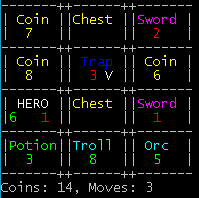
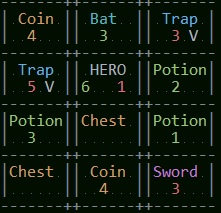

# Tactical Card Dungeon

Game prototype of a lite roguelike, you play HERO in windows CMD/ide, move with
arrows (asdw in
IDE),

Defeat ennemies, collect gold, pick weapons, open chest, avoid rotating
traps, etc..

Only one fullnight of work atm.

- green = life
- red = hits

It looks better on IDE,(change USE_IDE = True)

### Todo and issues :

- Auto detect use of IDE..
- Better random spawn, (if a lot of potion in board , always spawn an enemy for example, using rank attribute)
- Create the 'complex mod', using more attributes (durability, hit/life, etc)
- Create tkinter version with graphics_LOL
- Refector the moving functions (group in one function) ASAP
- Think of more random element , and karma stuff, (and short mod)
- Introduce magic

